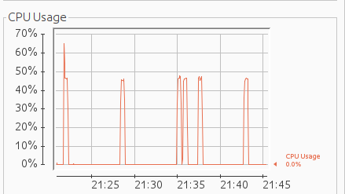

# rocket-nest-spring
This project will compare web application written with following frameworks:
- rocket (written in rust language)
- nest with express (written in nodejs)
- spring (written in java)

The web applications should be similar in functionality.

## Reading filesystem resources

The workflow here is following:
 - do a request with parameter 'extra'
 - do a basic validation
 - in the controller load a json file from filesystem
 - transform it to domain class (POJO)
 - add the `extra` property
 - return as JSON

Below results of calling endpoint by 100 virtual users (30 seconds):

##### Spring framework

```
@GetMapping("/spring-filesystem-read")
Sample read(@RequestParam(value = "extra") @NotBlank @Size(max = 100) String extra) {
    ObjectMapper mapper = new ObjectMapper();
    Sample json = mapper.readValue(ResourceUtils.getFile("classpath:sample.json"), Sample.class);
    json.setExtra(extra);
    return json;
}
```

- iterations = 444.533
- data received = 864 MB
- data sent = 53 MB
- total time for the request = avg=28.6µs   min=7.2µs    med=21.51µs  max=22.02ms p(90)=34.19µs  p(95)=42.22µs

```
data_received..................: 864 MB 29 MB/s
data_sent......................: 53 MB  1.7 MB/s
http_req_blocked...............: avg=2.9µs    min=580ns    med=1.24µs   max=7.57ms  p(90)=1.69µs   p(95)=2.16µs
http_req_connecting............: avg=1.09µs   min=0s       med=0s       max=7.52ms  p(90)=0s       p(95)=0s     
http_req_duration..............: avg=636.89µs min=150.58µs med=473.13µs max=34.09ms p(90)=1.04ms   p(95)=1.36ms
 { expected_response:true }...: avg=636.89µs min=150.58µs med=473.13µs max=34.09ms p(90)=1.04ms   p(95)=1.36ms
http_req_failed................: 0.00%  ✓ 0            ✗ 444533
http_req_receiving.............: avg=30.85µs  min=7.05µs   med=20.82µs  max=16.45ms p(90)=33.52µs  p(95)=44.62µs
http_req_sending...............: avg=6.92µs   min=2.79µs   med=5.96µs   max=12.58ms p(90)=7.75µs   p(95)=9.47µs
http_req_tls_handshaking.......: avg=0s       min=0s       med=0s       max=0s      p(90)=0s       p(95)=0s     
http_req_waiting...............: avg=599.11µs min=127.62µs med=444.36µs max=26.69ms p(90)=992.37µs p(95)=1.3ms  
http_reqs......................: 444533 14817.229048/s
iteration_duration.............: avg=670.18µs min=174.33µs med=503.37µs max=34.18ms p(90)=1.07ms   p(95)=1.41ms
iterations.....................: 444533 14817.229048/s
vus............................: 10     min=10         max=10  
vus_max........................: 10     min=10         max=10  

```

Memory:

We can see below the memory usage during the test (about 200MB).
The charts show also the work that GC needed to perform.


Threads:

In the test I have used NOT reactive Spring. So we can see that each new request creates a new thread.


The last chart shows the CPU utilization during the test.




##### nest.js


```
@Get()
async read(@Query() params: ReadParamDto): Promise<SampleDto> {
  const sample: SampleDto = await this.service.read();
  sample.extra = params.extra;
  return sample;
}

```

- iterations = 169.280
- data received = 66 MB
- data sent = 15 MB
- total time for the request = avg=18.3µs min=7.83µs   med=16.47µs max=3.21ms  p(90)=25.55µs p(95)=28.26µs

```
data_received..................: 66 MB  2.2 MB/s
data_sent......................: 15 MB  491 kB/s
http_req_blocked...............: avg=1.15µs min=594ns    med=904ns   max=2.9ms   p(90)=1.55µs  p(95)=1.67µs
http_req_connecting............: avg=16ns   min=0s       med=0s      max=1.87ms  p(90)=0s      p(95)=0s     
http_req_duration..............: avg=1.74ms min=983.98µs med=1.63ms  max=11.72ms p(90)=1.97ms  p(95)=2.62ms
 { expected_response:true }...: avg=1.74ms min=983.98µs med=1.63ms  max=11.72ms p(90)=1.97ms  p(95)=2.62ms
http_req_failed................: 0.00%  ✓ 0           ✗ 169280
http_req_receiving.............: avg=18.3µs min=7.83µs   med=16.47µs max=3.21ms  p(90)=25.55µs p(95)=28.26µs
http_req_sending...............: avg=4.79µs min=2.97µs   med=4.12µs  max=2.69ms  p(90)=6.9µs   p(95)=7.42µs
http_req_tls_handshaking.......: avg=0s     min=0s       med=0s      max=0s      p(90)=0s      p(95)=0s     
http_req_waiting...............: avg=1.71ms min=943.06µs med=1.61ms  max=11.69ms p(90)=1.95ms  p(95)=2.59ms
http_reqs......................: 169280 5642.295258/s
iteration_duration.............: avg=1.76ms min=1.03ms   med=1.65ms  max=11.76ms p(90)=2.01ms  p(95)=2.65ms
iterations.....................: 169280 5642.295258/s
vus............................: 10     min=10        max=10  
vus_max........................: 10     min=10        max=10
```


##### rust / rocket


```
#[get("/rust-filesystem-read?<extra>")]
pub fn get_filesystem_handler(extra: String) -> Json<FileSystem>  {
    let json_file = std::fs::read_to_string("sample.json").unwrap();
    let mut json: FileSystem = serde_json::from_str::<FileSystem>(&json_file).unwrap();
    json.extra = Some(extra);

    Json(json)
}

```

- iterations = 1.041.848
- data received = 2.1 MB
- data sent = 15 MB
- total time for the request = avg=18.3µs min=7.83µs   med=16.47µs max=3.21ms  p(90)=25.55µs p(95)=28.26µs

```
data_received..................: 2.1 GB  71 MB/s
data_sent......................: 119 MB  4.0 MB/s
http_req_blocked...............: avg=1.17µs   min=555ns   med=1.06µs   max=3.87ms   p(90)=1.3µs    p(95)=1.45µs  
http_req_connecting............: avg=0ns      min=0s      med=0s       max=121.71µs p(90)=0s       p(95)=0s      
http_req_duration..............: avg=259.33µs min=57.24µs med=209.07µs max=16.08ms  p(90)=468.82µs p(95)=504.03µs
 { expected_response:true }...: avg=259.33µs min=57.24µs med=209.07µs max=16.08ms  p(90)=468.82µs p(95)=504.03µs
http_req_failed................: 0.00%   ✓ 0            ✗ 1041848
http_req_receiving.............: avg=15.7µs   min=5.83µs  med=13.43µs  max=10.74ms  p(90)=17.53µs  p(95)=19.94µs
http_req_sending...............: avg=5.41µs   min=2.89µs  med=5.09µs   max=7.75ms   p(90)=6.09µs   p(95)=6.75µs  
http_req_tls_handshaking.......: avg=0s       min=0s      med=0s       max=0s       p(90)=0s       p(95)=0s      
http_req_waiting...............: avg=238.21µs min=44.63µs med=189µs    max=16.05ms  p(90)=449.24µs p(95)=483.64µs
http_reqs......................: 1041848 34727.175629/s
iteration_duration.............: avg=284.61µs min=73.43µs med=234.21µs max=18.61ms  p(90)=492µs    p(95)=527.66µs
iterations.....................: 1041848 34727.175629/s
vus............................: 10      min=10         max=10   
vus_max........................: 10      min=10         max=10   

```
