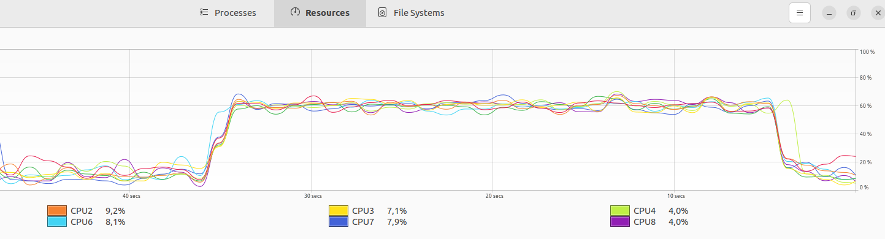

# rocket-nest-spring
This project will compare web application written with following frameworks:
- rocket (written in rust language)
- nest with express (written in nodejs)
- spring (written in java)

The web applications should be similar in functionality.

## Reading filesystem resources

The workflow here is following:
 - do a request with parameter 'extra'
 - do a basic validation
 - in the controller load a json file from filesystem
 - transform it to domain class (POJO)
 - add the `extra` property
 - return as JSON

Below results of calling endpoint by 100 virtual users (30 seconds):

##### Spring framework

```
@GetMapping("/spring-filesystem-read")
Sample read(@RequestParam(value = "extra") @NotBlank @Size(max = 100) String extra) {
    ObjectMapper mapper = new ObjectMapper();
    Sample json = mapper.readValue(ResourceUtils.getFile("classpath:sample.json"), Sample.class);
    json.setExtra(extra);
    return json;
}
```

- iterations = 493.896
- data received = 154 MB
- data sent = 51 MB
- total time for the request = avg=28.6µs   min=7.2µs    med=21.51µs  max=22.02ms p(90)=34.19µs  p(95)=42.22µs

```
data_received..............: 154 MB  5.1 MB/s
data_sent..................: 51 MB   1.7 MB/s
http_req_blocked...........: avg=2.88µs   min=586ns    med=1.2µs    max=7.89ms  p(90)=1.61µs   p(95)=2µs    
http_req_connecting........: avg=1.11µs   min=0s       med=0s       max=7.85ms  p(90)=0s       p(95)=0s     
http_req_duration..........: avg=569.7µs  min=117.07µs med=456.9µs  max=22.39ms p(90)=941.04µs p(95)=1.18ms
http_req_failed............: 100.00% ✓ 493896       ✗ 0   
http_req_receiving.........: avg=28.6µs   min=7.2µs    med=21.51µs  max=22.02ms p(90)=34.19µs  p(95)=42.22µs
http_req_sending...........: avg=6.7µs    min=2.79µs   med=5.79µs   max=17.02ms p(90)=7.52µs   p(95)=8.97µs
http_req_tls_handshaking...: avg=0s       min=0s       med=0s       max=0s      p(90)=0s       p(95)=0s     
http_req_waiting...........: avg=534.39µs min=90.95µs  med=427.09µs max=20.37ms p(90)=898.73µs p(95)=1.12ms
http_reqs..................: 493896  16462.764877/s
iteration_duration.........: avg=602.84µs min=137.92µs med=486.84µs max=22.56ms p(90)=977.85µs p(95)=1.22ms
iterations.................: 493896  16462.764877/s
vus........................: 10      min=10         max=10
vus_max....................: 10      min=10         max=10
```

Memory:

We can see below the memory usage during the test (about 200MB).
The charts show also the work that GC needed to perform.


Threads:

In the test I have used NOT reactive Spring. So we can see that each new request creates a new thread.


The last chart shows the CPU utilization during the test.




##### nest.js


```
@Get()
async read(@Query() params: ReadParamDto): Promise<SampleDto> {
  const sample: SampleDto = await this.service.read();
  sample.extra = params.extra;
  return sample;
}

```

- iterations = 169.280
- data received = 66 MB
- data sent = 15 MB
- total time for the request = avg=18.3µs min=7.83µs   med=16.47µs max=3.21ms  p(90)=25.55µs p(95)=28.26µs

```
data_received..................: 66 MB  2.2 MB/s
data_sent......................: 15 MB  491 kB/s
http_req_blocked...............: avg=1.15µs min=594ns    med=904ns   max=2.9ms   p(90)=1.55µs  p(95)=1.67µs
http_req_connecting............: avg=16ns   min=0s       med=0s      max=1.87ms  p(90)=0s      p(95)=0s     
http_req_duration..............: avg=1.74ms min=983.98µs med=1.63ms  max=11.72ms p(90)=1.97ms  p(95)=2.62ms
 { expected_response:true }...: avg=1.74ms min=983.98µs med=1.63ms  max=11.72ms p(90)=1.97ms  p(95)=2.62ms
http_req_failed................: 0.00%  ✓ 0           ✗ 169280
http_req_receiving.............: avg=18.3µs min=7.83µs   med=16.47µs max=3.21ms  p(90)=25.55µs p(95)=28.26µs
http_req_sending...............: avg=4.79µs min=2.97µs   med=4.12µs  max=2.69ms  p(90)=6.9µs   p(95)=7.42µs
http_req_tls_handshaking.......: avg=0s     min=0s       med=0s      max=0s      p(90)=0s      p(95)=0s     
http_req_waiting...............: avg=1.71ms min=943.06µs med=1.61ms  max=11.69ms p(90)=1.95ms  p(95)=2.59ms
http_reqs......................: 169280 5642.295258/s
iteration_duration.............: avg=1.76ms min=1.03ms   med=1.65ms  max=11.76ms p(90)=2.01ms  p(95)=2.65ms
iterations.....................: 169280 5642.295258/s
vus............................: 10     min=10        max=10  
vus_max........................: 10     min=10        max=10
```


