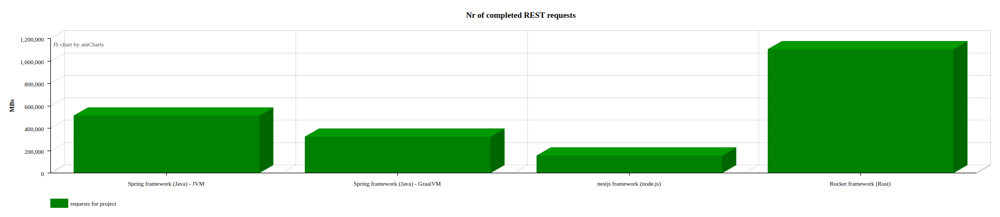

# rocket-nest-spring
This project will compare web application written with following frameworks:
- rocket (written in rust language)
- nest with express (written in nodejs)
- spring (written in java)
  - running in JVM
  - running in GraalVM

The web applications should be similar in functionality.

## Results:

[Reading filesystem resources](#reading-filesystem-resources)




## Reading filesystem resources

The workflow here is following:
 - do a request with parameter 'extra'
 - do a basic validation
 - in the controller load a json file from filesystem
 - transform it to domain class (POJO)
 - add the `extra` property
 - return as JSON

Below results of calling endpoint by 10 virtual users (30 seconds):

#### Code

Following controllers have been tested:

##### Spring framework (Java)

```
@GetMapping("/spring-filesystem-read")
Sample read(@RequestParam(value = "extra") @NotBlank @Size(max = 100) String extra) {
    ObjectMapper mapper = new ObjectMapper();
    Sample json = mapper.readValue(ResourceUtils.getFile("classpath:sample.json"), Sample.class);
    json.setExtra(extra);
    return json;
}
```

##### nestjs framework (node.js)

```
@Get()
async read(@Query() params: ReadParamDto): Promise<SampleDto> {
  const sample: SampleDto = await this.service.read();
  sample.extra = params.extra;
  return sample;
}

```

##### Rocket framework (Rust)

```
#[get("/rust-filesystem-read?<extra..>", rank = 1)] //
pub fn get_filesystem_handler(extra: FileSystemReq) -> Json<FileSystem>  {
    let json_file = std::fs::read_to_string("sample.json").unwrap();
    let mut json: FileSystem = serde_json::from_str::<FileSystem>(&json_file).unwrap();
    json.extra = Some(extra.extra);

    Json(json)
}

```

#### Statistics

Below Statistics generated with k6 script (/lib/k6/filesystem-get)

##### Spring framework (Java)

- iterations = 511.542

```
data_received..................: 995 MB 33 MB/s
data_sent......................: 60 MB  2.0 MB/s
http_req_blocked...............: avg=2.79µs   min=553ns    med=1.17µs   max=6.76ms  p(90)=1.58µs   p(95)=1.9µs  
http_req_connecting............: avg=1µs      min=0s       med=0s       max=4.45ms  p(90)=0s       p(95)=0s     
http_req_duration..............: avg=550.33µs min=140.64µs med=457.34µs max=19.35ms p(90)=798.33µs p(95)=1.09ms
 { expected_response:true }...: avg=550.33µs min=140.64µs med=457.34µs max=19.35ms p(90)=798.33µs p(95)=1.09ms
http_req_failed................: 0.00%  ✓ 0            ✗ 511542
http_req_receiving.............: avg=24.53µs  min=6.99µs   med=20.12µs  max=15.25ms p(90)=29.37µs  p(95)=33.78µs
http_req_sending...............: avg=6.55µs   min=2.82µs   med=5.63µs   max=7.79ms  p(90)=7.34µs   p(95)=8.37µs
http_req_tls_handshaking.......: avg=0s       min=0s       med=0s       max=0s      p(90)=0s       p(95)=0s     
http_req_waiting...............: avg=519.25µs min=123.22µs med=429.68µs max=19.32ms p(90)=760.31µs p(95)=1.05ms
http_reqs......................: 511542 17050.744337/s
iteration_duration.............: avg=582µs    min=165.19µs med=486.81µs max=19.38ms p(90)=838.3µs  p(95)=1.12ms
iterations.....................: 511542 17050.744337/s
vus............................: 10     min=10         max=10  
vus_max........................: 10     min=10         max=10

```

##### nestjs framework (node.js)

- iterations = 155.183

```
data_received..................: 60 MB  2.0 MB/s
data_sent......................: 14 MB  450 kB/s
http_req_blocked...............: avg=1.09µs min=578ns    med=914ns   max=346.74µs p(90)=1.59µs  p(95)=1.75µs
http_req_connecting............: avg=7ns    min=0s       med=0s      max=217.76µs p(90)=0s      p(95)=0s     
http_req_duration..............: avg=1.9ms  min=920.25µs med=1.74ms  max=30.29ms  p(90)=2.26ms  p(95)=2.9ms  
 { expected_response:true }...: avg=1.9ms  min=920.25µs med=1.74ms  max=30.29ms  p(90)=2.26ms  p(95)=2.9ms  
http_req_failed................: 0.00%  ✓ 0           ✗ 155183
http_req_receiving.............: avg=16.9µs min=7.78µs   med=14.87µs max=3.3ms    p(90)=23.53µs p(95)=26.41µs
http_req_sending...............: avg=4.82µs min=2.93µs   med=4.12µs  max=2.41ms   p(90)=6.96µs  p(95)=7.52µs
http_req_tls_handshaking.......: avg=0s     min=0s       med=0s      max=0s       p(90)=0s      p(95)=0s     
http_req_waiting...............: avg=1.88ms min=896.02µs med=1.72ms  max=30.26ms  p(90)=2.23ms  p(95)=2.87ms
http_reqs......................: 155183 5172.413164/s
iteration_duration.............: avg=1.92ms min=959.86µs med=1.76ms  max=30.34ms  p(90)=2.29ms  p(95)=2.93ms
iterations.....................: 155183 5172.413164/s
vus............................: 10     min=10        max=10  
vus_max........................: 10     min=10        max=10

```

##### Rocket framework (Rust)

- iterations = 1.104.840

```
data_received..................: 2.3 GB  75 MB/s
data_sent......................: 126 MB  4.2 MB/s
http_req_blocked...............: avg=1.12µs   min=539ns   med=1.06µs   max=2.31ms   p(90)=1.31µs   p(95)=1.47µs  
http_req_connecting............: avg=1ns      min=0s      med=0s       max=234.98µs p(90)=0s       p(95)=0s      
http_req_duration..............: avg=242.46µs min=56.63µs med=200.11µs max=27.11ms  p(90)=434.95µs p(95)=474.89µs
 { expected_response:true }...: avg=242.46µs min=56.63µs med=200.11µs max=27.11ms  p(90)=434.95µs p(95)=474.89µs
http_req_failed................: 0.00%   ✓ 0            ✗ 1104840
http_req_receiving.............: avg=15.77µs  min=5.84µs  med=13.28µs  max=13.94ms  p(90)=17.02µs  p(95)=19.12µs
http_req_sending...............: avg=5.42µs   min=2.66µs  med=5.04µs   max=10.43ms  p(90)=6.13µs   p(95)=6.82µs  
http_req_tls_handshaking.......: avg=0s       min=0s      med=0s       max=0s       p(90)=0s       p(95)=0s      
http_req_waiting...............: avg=221.26µs min=43.42µs med=180.58µs max=27.09ms  p(90)=415.8µs  p(95)=454.2µs
http_reqs......................: 1104840 36826.833413/s
iteration_duration.............: avg=268.1µs  min=72.41µs med=224.85µs max=27.14ms  p(90)=457.97µs p(95)=499.49µs
iterations.....................: 1104840 36826.833413/s
vus............................: 10      min=10         max=10   
vus_max........................: 10      min=10         max=10  

```


### CPU usage

Below the comparison of CPU utilization:


##### Spring framework (Java)

- utilization: 60%


##### nestjs framework (node.js)

- utilization: 20% - 60% (event loop is crazy here)


##### Rocket framework (Rust)

- utilization: 60%


### Memory usage

- Spring framework (Java):
  - JVM - from 158 MB to 448 MB
  - GraalVM - from 84 MB to 11 9MB
- nestjs framework (node.js): from 44MB to 81MB
- Rocket framework (Rust): from 5MB to 7MB


### Other (framework specific)


[Spring] Below heap usage for Spring Framework + work of garbage collector:


[Spring] Threads: in the tests I have NOT used reactive Spring. Because of that, we can see that each new request creates a new thread.


[nestjs] Some Statistics for JS event loop:


